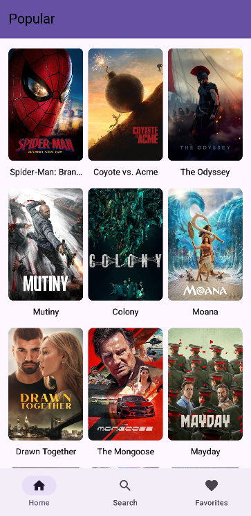
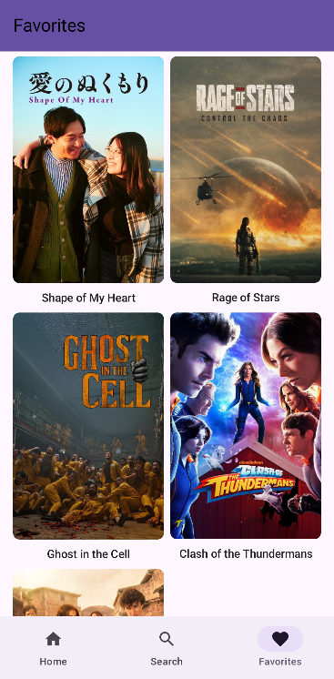

# 🎬 MoviesDB

A native Android application built to explore and master Jetpack Compose, modern MVVM architecture, and API integration using [The Movie Database (TMDB) API](https://www.themoviedb.org/documentation/api).

## 📸 Screenshots

<div align="center">
  
  &nbsp;&nbsp;&nbsp;&nbsp;
  
</div>

## ✨ Features

- **Discover Movies:** Browse a dynamically loaded 3-column grid of popular movies.
- **Detailed Views:** Tap any movie to view high-quality posters, titles, and full plot overviews.
- **Local Favorites:** Save and manage favorite movies locally in a dedicated 2-column grid. The UI reacts instantly to database changes.
- **Persistent Navigation:** Features a Material Design 3 Bottom Navigation Bar that saves scroll state and back-stack history across tabs.
- **Reactive UI:** Loading, success, and error states are handled cleanly using sealed UI state interfaces.

## 🛠️ Tech Stack & Architecture

This application strictly follows the **MVVM (Model-View-ViewModel)** architectural pattern with Unidirectional Data Flow (UDF).

- **UI:** Jetpack Compose (Material 3)
- **Architecture:** MVVM + Repository Pattern
- **Dependency Injection:** Dagger Hilt
- **Local Persistence:** Room Database (SQLite)
- **Networking:** Retrofit2 & OkHttp
- **Asynchronous Programming:** Kotlin Coroutines & `Flow` / `StateFlow`
- **Image Loading:** Coil
- **Annotation Processing:** KSP (Kotlin Symbol Processing)

### Architecture Flow

```text
UI (Compose)  ───►  ViewModel  ───►  Repository  ───►  TMDB API (Remote Network)
     ▲                    │               │
     └── StateFlow ───────┘               └───►  Room Database (Local Cache)
```

- **`NetworkModule` & `DatabaseModule`** — Hilt modules providing singletons for Retrofit and Room.
- **`MovieRepository`** — Single source of truth fetching data from the API and observing local favorites from Room.
- **`ViewModels`** — Injected via `@HiltViewModel`, exposing UI states (`Loading`, `Success`, `Error`) via `StateFlow`.
- **`MovieEntity` / `MovieResponse`** — Distinct data models separating local database tables from JSON network responses.

## 📱 Screens

| Screen | Description |
|---|---|
| **Home Screen** | Shows popular movies in a scrollable 3-column grid with posters and titles. |
| **Favorites Screen** | A 2-column grid displaying locally saved movies. Updates instantly via Room `Flow`. |
| **Movie Detail** | Displays the full poster, title, overview, and a dynamic heart toggle to add/remove the movie from Favorites. |

## 🚀 Setup

1. Clone the repository.
2. Get a free API key from [TMDB](https://www.themoviedb.org/settings/api).
3. Open the project in Android Studio. Ensure you are using a modern Gradle setup compatible with Kotlin `2.4.20`.
4. Add your API key securely. Open your `local.properties` file (create one in the root directory if it doesn't exist) and add the following line:
   ```properties
   TMDB_API_KEY="your_actual_api_key_here"
   ```
   *(Note: Ensure your app's `build.gradle.kts` is configured to read from `local.properties` via `BuildConfig` so the key isn't hardcoded).*
5. Build and run the app on an emulator or physical device.

## 📦 Key Dependencies

```kotlin
// UI & Navigation
implementation("androidx.navigation:navigation-compose:2.8.0")
implementation("io.coil-kt:coil-compose:2.6.0")

// Dependency Injection
implementation("com.google.dagger:hilt-android:2.51.1")
ksp("com.google.dagger:hilt-compiler:2.51.1")

// Local Database
implementation("androidx.room:room-runtime:2.6.1")
implementation("androidx.room:room-ktx:2.6.1")
ksp("androidx.room:room-compiler:2.6.1")
```

## 🗺️ Roadmap & Next Steps

- [x] Fill in movie detail screen with full info
- [x] Add favorites/watchlist (local storage via Room)
- [x] Implement Bottom Navigation
- [ ] Add search functionality
- [ ] Add pagination / infinite scroll
- [ ] Add pull-to-refresh

## 📄 License

Personal project — no license, use however you like.
